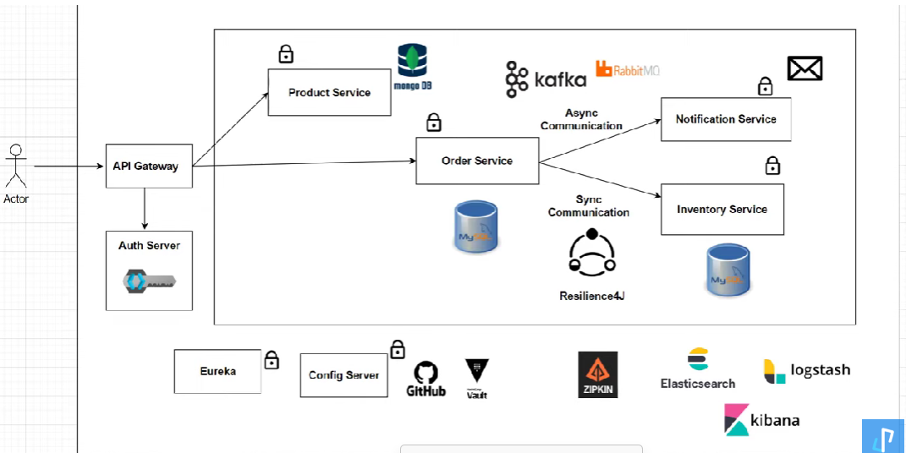

# Build Spring Boot Microservices

#### High architecture

### Service we are going to build
- **Product Service** - Create and View Products, acts as Product Catalog
- **Order Service** - Can Order Products
- **Inventory Service** - Can check if products in stock or not
- **Notification Service** - Can send notifications, after order is placed
- **Order Service**, **Inventory Service** and **Notification Service** are going to interact with each other
- Synchronous and Asynchronous communication

#### Create image docker keycloak
docker run -p 8181:8080 -e KEYCLOAK_ADMIN=admin -e KEYCLOAK_ADMIN_PASSWORD=admin quay.io/keycloak/keycloak:22.0.4 start-dev

#### Create image docker zipkin
docker run -d -p 9411:9411 openzipkin/zipkin

#### Refer document
[spring-cloud-gateway-eureka-service-discovery](https://github.com/BarathArivazhagan/spring-cloud-gateway-eureka-service-discovery/blob/master/docker-compose.yml)

#### Security
- Keycloak

#### Distributed Tracing
- Spring Cloud Sleuth -> generate traceId and spanId
- OpenZipkin -> visualize